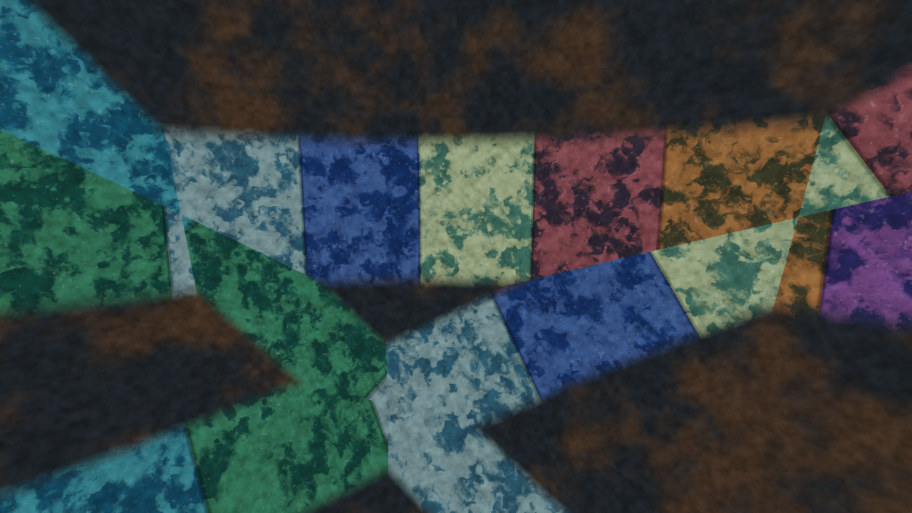
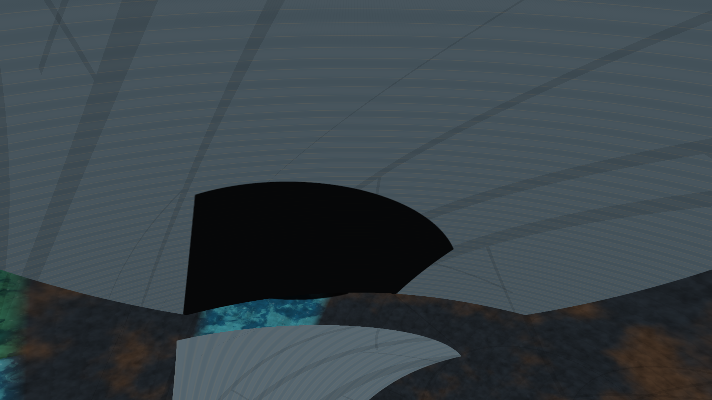

# The Sphere Observatory

**Fly inside a Dyson shell at Earth's orbital radius. Explore its light, measure its scale, and save reproducible photographs.**

A local WebGL 2 instrument inspired by **The Sphere** worldbuilding project. The shell has a radius of 149,597,870.7 km around a Sun-sized star: approximately **551 million Earth surface areas** on the inside.



Current version: **0.9**. This is a working visualization prototype, not a finished game or a complete physics simulator.

## Run locally

Download this repository as a ZIP and extract it. On Windows, double-click **Launch Observatory.cmd**. It starts one managed localhost server and opens the Observatory in Chrome or Edge. When finished, double-click **Stop Observatory.cmd**; the stop action is safe to repeat. Hardware acceleration and WebGL 2 are required.

Alternatively, with Node.js 20 or later:

```sh
npm start
```

Open **http://127.0.0.1:8766/**. If the port is occupied, use `node serve.cjs 8767`. Stop the server with Ctrl+C. It listens only on localhost.

For a durable command-line workflow, use `npm run start:managed` and stop it with `npm run stop`. The managed stop command cleans the recorded PID and any orphaned `serve.cjs` process whose script path is this repository, without matching unrelated Node services. If a terminal or browser is closed unexpectedly, run the stop command before launching again.

Use localhost for the full experience. Opening `index.html` directly can restrict worker and texture access in some browsers; the renderer falls back to procedural materials and cached CPU lighting.

### Performance prerequisite

The browser must use hardware WebGL. In Chrome, open **Settings → System**, turn on **Use graphics acceleration when available**, then fully restart Chrome before launching Observatory. A quick diagnostic is `chrome://gpu`: WebGL should use a hardware ANGLE backend; if it reports `d3d11-warp-webgl`, rendering has fallen back to the CPU and performance will be poor. This setting is browser/machine state rather than application state, so it cannot be carried by GitHub; keep this prerequisite with the run instructions.

**No build step or runtime package installation.** No account, API key, cloud service, telemetry or runtime image generation. Testing has primarily used Windows, Edge and an RTX 5080; performance on other systems may differ substantially.

## New in v0.9

Ten hero biome landscapes with bump shading, larger non-mirrored surface detail, regional atmosphere colours, and a redesigned exploration workflow. Live indirect lighting runs off the main thread; adaptive preview supports up to 4K output. See surface lands under the crosshair, and nearby arrivals level within 1,000 km.


[Before/after screenshots](examples/hero-review/) · [Performance and implementation](docs/Observatory-Hero-Textures-10.md) · [Independent visual review](docs/texture-critic-review.md)

## First exploration

1. Use the bottom **Overview / Surface / Shade fleet / Wounds / Star** destinations. They preserve world, time and lighting while choosing a useful camera, lens and flight speed.
2. Use **World → Before / After the attack** to compare the same location and time. Regions & shade engineering controls the layout and fleet.
3. **See surface** lands 3 km above the region under your crosshair; **Return to view** restores the original camera. **Explore → Explore a biome** offers ten named destinations at 1,000 / 100 / 10 / 1 km. Staged lighting studies are separately labelled because they replace scene conditions.
4. Adjust exposure and sampling under **Light**. Save images and complete scenes under **Capture**.

Drag to look. **W/A/S/D** fly, **Q/E** move down/up, and **Z/X** turn left/right. **Shift** accelerates, and the wheel changes speed. **Space** starts or pauses shade motion. **H** hides view overlays. Camera destinations within 1,000 km of the inner surface automatically level to the local surface.

Altitude describes the nearest surface below you. Looking into the sky can mean looking hundreds of millions of kilometres across the cavity. **Explore → Exact position & direction → Look straight down** turns toward nearby material.

## Features

- Analytic shell, stellar disk and shade intersections at a one-AU scale.
- Before/after views of designed region belts, six wounds, service rings and a shade fleet.
- Planar, square, curved-cap and trimmed-cap shade designs with kilometre-based construction detail.
- Three prescribed routes containing 8, 6 and 4 intact shades. Successive passages are 24, 36 and 60 hours apart; full circuits take 8, 9 and 10 days.
- Shadows integrated over the stellar disk, with overlapping station and shade blockers.
- Approximate coloured ShellShine, atmosphere enabled by default with regional colours, and ten biome hero landscapes with continuous mip detail and optional bump shading.
- Curved-surface area measurement in square kilometres and **Earth surfaces**, including freehand outlines.
- HD/4K/8K PNG photographs with scene JSON, panoramas, bookmarks and local SDR motion studies.



These images come from the renderer. Import companion JSON files from [examples](examples/) using **Capture → Import scene**.

## Quality and workload

Live preview output supports up to 4K (8.29 million pixels), with selectable 15/30/60 fps ceilings; new installs default to 60 fps. Adaptive resolution reduces live pixel count when GPU time exceeds the frame budget, then recovers detail when there is headroom. Supersampling has a separate 2.07-million-pixel budget and never enlarges a 4K output. Still views stop rendering and hidden tabs pause. These are workload controls, not watt limits or guaranteed frame rates.

Antialiasing offers supersampling alone or additional contrast-edge filtering. At the full preview ray budget there is no supersampling headroom; the optional edge filter still operates on supported GPUs and can soften fine details. Material rendering uses a half-float light buffer when available, with a compatibility fallback. Output is **SDR**.

Station shadow integration defaults to **64 rays**, with 19/128/256 available. Higher values reduce false bands and cost GPU work. The original 7/19 setting applies with the station disabled. A 4K photograph can render internally at 7680 × 4320; metadata records the actual pipeline and dimensions.

Start with defaults. Reduce preview detail or use 19 station rays if interaction is slow. Video recording is real-time and may miss its target frame rate at demanding settings.

## Scientific boundaries

**Geometric scale is the foundation; the entire world is not physically solved.**

CPU geometry uses double precision; GPU calculations use normalized floating point with finite precision limits. Surface patterns are illustrative materials on a smooth shell, not resolved terrain or ecosystems. Wounds have no resolved deck thickness.

Shade motion is prescribed, not gravitational orbital motion. Gravity, shell support, heat disposal, propulsion and atmosphere retention are assumed. Light travel time, climate, material strength, evolving debris and station thermal emission are not simulated. The stellar disk has uniform brightness rather than limb darkening. Atmosphere and ShellShine are approximations, not converged global transport.

Sampling artifacts remain. In the station study, mean error against 8,192 CPU rays fell from 1.17 percentage points at 19 rays to 0.44 at 128. Six of 10,710 GPU/CPU probes differed by one ray at 128 samples. This is tested evidence, not universal accuracy certification.

## Tests and notes

Run dependency-free numerical checks:

```sh
npm test
```

Browser tests additionally require a locally installed Playwright package and a Chromium-family browser. These are development dependencies only. Set `SPHERE_PLAYWRIGHT` to the package's absolute path if it is not resolvable as `playwright`, and `SPHERE_BROWSER` to the browser executable. HTTP tests default to port 8766 and accept `SPHERE_URL`; some original tests load the HTML file directly. Run browser tests sequentially to avoid GPU contention.

```sh
node tests/collection-browser.cjs
node tests/shade-light-browser.cjs
node tests/station-browser.cjs
node tests/visual-quality-browser.cjs
node tests/edge-filter-browser.cjs
```

The station test reports finite-precision discrepancies and checks a one-source-ray-plus-quantization bound. Edge filtering records both squared and absolute errors because smoothing does not improve every metric.

- [Hero landscapes, relief and the three-pass review](docs/Observatory-Hero-Textures-10.md)
- [Independent visual scores](docs/texture-critic-review.md)
- [Performance, biome LOD and navigation](docs/Observatory-Performance-Biomes-09.md)
- [Collection layout](docs/Observatory-Collection-Study-01.md)
- [Shade design and clearance](docs/Observatory-Shade-Standard-01.md)
- [Linear lighting and UI](docs/Observatory-Visual-Quality-06.md)
- [Edge-filter tradeoffs](docs/Observatory-Visual-Quality-07.md)
- [Station integration results](docs/Observatory-Station-Light-08.md)

Historical notes describe their named version; this README describes the current release.

## Project

Created by Joe Cauley with AI-assisted development. Scientific corrections, reproducible rendering issues and hardware/browser test results are welcome. A scene JSON helps reproduce an issue.

## License

No reuse license has been selected for this initial public release. Public visibility does not itself grant a software license.
