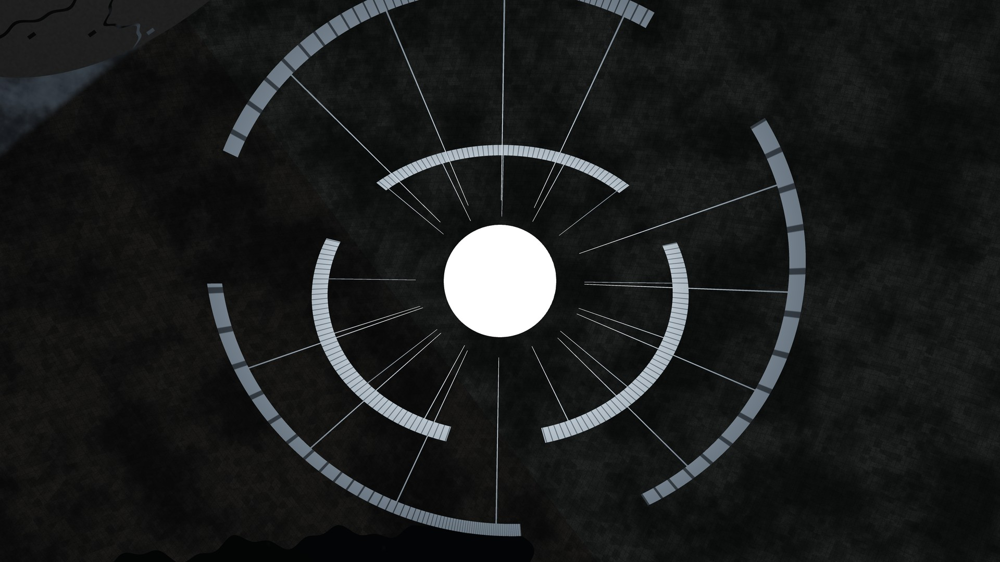
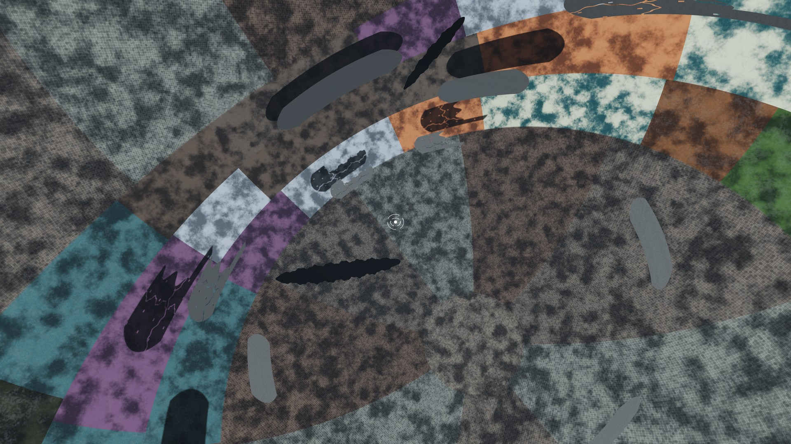
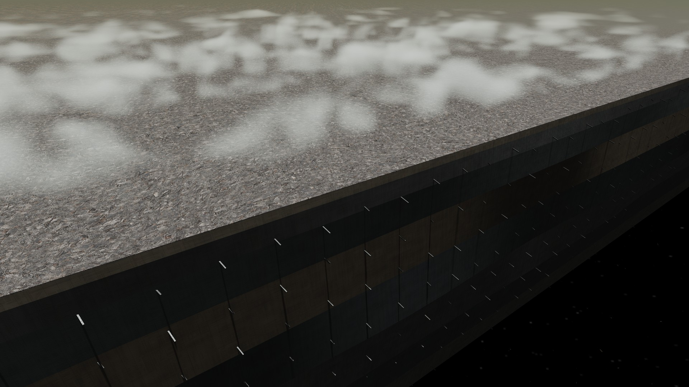
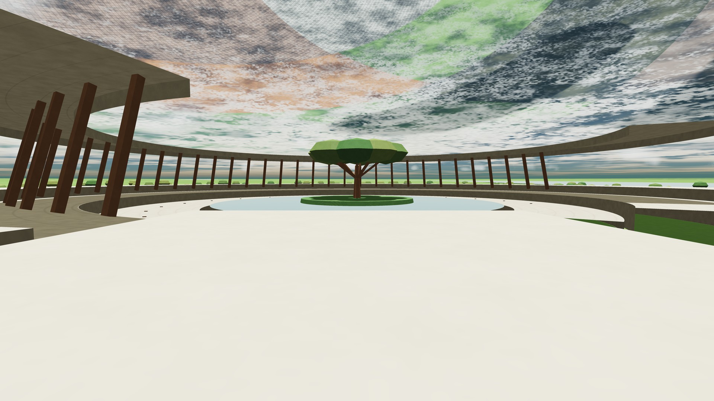
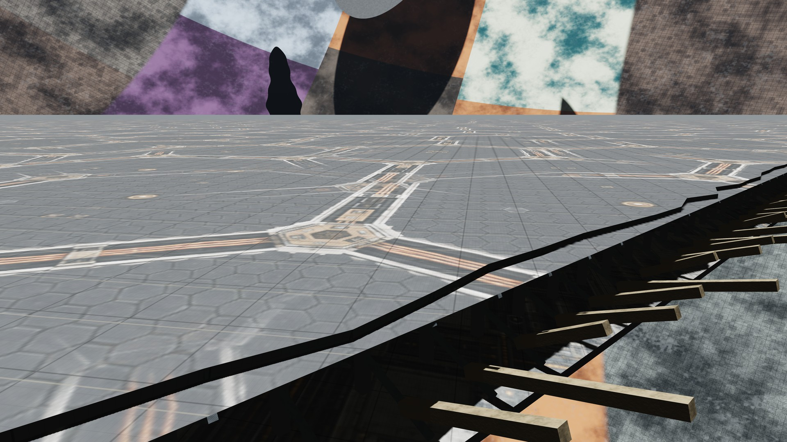
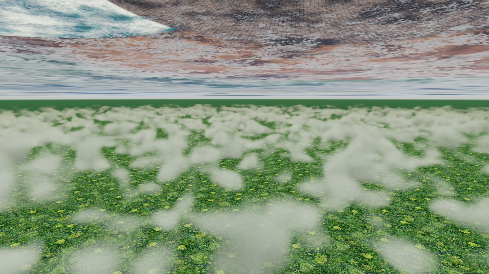

# The Sphere Observatory

**A world around a star. A physically accurate foundation for limitless storytelling and exploration.**

The Sphere Observatory is a working, locally run exploration app for **The Sphere**: an inhabited Dyson shell enclosing a Sun-sized star at the radius of Earth's orbit. Fly across its immense interior, descend through clouds into unfamiliar landscapes, inspect a broken megastructure, and save a photograph of a place you can return to.

The ambition is to make an extraordinary fictional world hold together. What would the sky look like from its inner surface? How would continent-dwarfing Shades change the light? What could someone see from the edge of a breach opening into space? Stories should be able to grow from consistent places, distances and physical consequences. The Observatory is where we build and test that foundation.



*The stellar conservatory: a close view of the central star and its damaged service rings, with the far shell behind them. [Restore this viewpoint](examples/observatory/interior.json).*

**Working prototype, actively developed.** Geometry, exploration, measurement and reproducible captures work today. Full physical accuracy is the goal; lighting, weather and engineering still have explicit approximations and unsolved parts. The gallery shows the current source build. [v1.4.0](https://github.com/JoeCauley/sphere-observatory/releases/tag/v1.4.0) is the latest tagged release; download the current repository for subsequent travel, weather and Watershed work.

## New in the current build

- **A larger Watershed to explore.** The Watershed pack connects the original river garden to an irregular neighbourhood of receiving reaches and open country. Enter through **Explore → Places**, or try the 40,000 km and 10,000 km views in Explore. [Pack details](docs/Observatory-Watershed-Pack-01.md).
- **Smoother journeys from clouds to ground.** Cloud sampling follows the rendered detail level, and local terrain blends into the distant shell as its relief becomes too small to see. Province surfaces retain opaque depth and geographic material blending; Wound edges retain their watertight seams. Cloud scale and travel controls are preserved, with edge speed independent of where you look.
- **Automatic intact and broken Shade edges.** Approach a nearby Shade without selecting a site to reveal finished intact edges or broken layers, recessed backing and braces. The structures follow the moving Shade and cover perimeters, corners, fractures and holes.
- **Connected walking terrain.** New landings prepare adjoining terrain as you walk, with shared borders and stable object positions. Walking can continue beyond the old sample boundaries while preserving the original arrival address. The river garden and existing revision-1 geography remain intact.
- **More reliable repeat captures.** Still and panorama exports complete their rendering before encoding. Cold/repeat captures, ascent/descent returns and cloud transitions now pass the recorded regression checks.

New scenes enable automatic Shade edges and connected terrain. To opt in from an older saved scene, use **World → Shell geography → Shade edge detail** and **Camera → Field expeditions → Terrain for new landings**. Existing saved field sites keep their original terrain and addresses.

The current build passed **28 numerical suites and 17 browser suites**, including a walk through 22 terrain joins and back, ascent/descent, and paired 4K captures. Cold shader preparation can still take time; finished environments across both Shade faces and authored terrain across the whole Sphere remain future work. [Changes, compatibility and verification](docs/Observatory-Continuity-03.md).

## A scale worth stopping to imagine

| At the default scale | Dimension |
|---|---:|
| Star to inner shell | **149,597,870.7 km — one astronomical unit** |
| Across the entire cavity | **299.2 million km** |
| Around the shell on a great circle | **940 million km** |
| Total inner spherical surface | **281 quadrillion km²** |
| Equivalent Earth surfaces, including land and oceans | **551 million** |
| Central star | **1,391,400 km across** |
| Light crossing the cavity's diameter | **16 minutes 38 seconds** |

These are dimensions of the mathematical world, not a claim that every square metre contains finished terrain. The surface comparison uses Earth's mean radius of 6,371 km and the full sphere before subtracting Wounds. Light-crossing time is a scale reference; delayed light propagation is not yet simulated.

The app bridges that world with a **640 km Watershed province**, connected kilometre-scale walking chunks, local buildings and metre-scale material detail. At a low altitude, the surface beneath you may be close enough to walk on while the surface in your sky is hundreds of millions of kilometres away. Making those scales agree is central to the project.



*Across the interior: distant Shades, enormous Wounds and the habitat waist. [Scene and 4K photograph](examples/observatory/README.md#across-the-interior).*

## One world, many kinds of exploration

**The interior and its history.** Explore a designed habitat waist, ten biome families, supporting Builder regions and two polar entry complexes. Switch between before and after the attack while retaining camera and time. Six immense **Wounds** open through the shell; the damaged world retains broken Shades, exposed structural layers and an exterior graveyard. These are authored historical states, not a simulated destruction event.

**Light and the Shade fleet.** Eighteen intact Shades occupy three maintained routes. Their successive passages occur at 24, 36 and 60 hours; complete circuits take 8, 9 and 10 days. A finite stellar disk produces eclipses and sampled penumbrae, with overlapping Shade and stellar-station shadows. Reflected **ShellShine**, local atmosphere and layered clouds help explore what an enclosed world's light could look like.



*A Wound turns the edge of the landscape into the edge of the world. [Scene](examples/observatory/wound.json).*

**Places at human scale.** Visit ten biome field sites with connected walking terrain, polar courts, Shade edge structures and the Watershed's river gardens. The first province connects a stable catchment landscape with rivers, terraces, planted courts and Builder architecture. Nearby terrain and structures participate in picking, collision, shadows and photographs.



*The same project that models an astronomical-unit shell also makes room for a river garden. [Scene](examples/observatory/river-garden.json).*

**Travel, look and measure.** Walk, lift off, fly through the cavity and descend onto the far shell. Use Places, exact coordinates or a point selected in the view; retrace your arrivals with return history. Measure a visible curved-surface outline in square kilometres or Earth surfaces. Measurements exclude openings and foreground objects and can be saved with their scenes.

**Keep your discoveries.** Export HD, 4K or supported 8K PNG photographs, 360° panoramas and local SDR motion studies. Each photograph can carry the camera, world settings, seed, simulation time and rendering metadata in an importable scene JSON. Bookmarks and automatic session restoration make returning easy; exported scenes provide a portable record.

| On the moving megastructure | Beneath the distant shell |
|---|---|
|  |  |

**[Explore the new gallery and its saved scenes](examples/observatory/)** · [Previous photographs and README](examples/archive/README.md)

These are photographs from the running renderer, without external compositing or retouching. The README uses smaller display copies; the gallery links the unchanged 4K originals. Some in-app material artwork was created with AI assistance; the screenshots themselves are rendered scenes, and the app performs no runtime image generation.

## What physically grounded means here

The goal is a foundation that can support open-ended stories and exploration: a place should keep its identity as you approach, its dimensions should survive measurement, and its light and motion should follow declared models. More detail should reveal the same world.

| Implemented foundation | Present boundary |
|---|---|
| Analytic shell and star, measured camera geometry, occlusion and apparent sizes | GPU precision and pixel resolution remain finite |
| Shared geometry for visible local structures, picking and collision | Most of the shell remains an analytic surface with illustrative materials |
| Finite-source eclipse sampling and overlapping blockers | Stellar brightness is uniform; shadow integration is sampled |
| Coloured first-bounce ShellShine, atmosphere and volumetric weather | Approximate light transport; no converged global illumination, climate or radiative equilibrium |
| Moving Shades and before/after world states | Prescribed maintained routes; no orbital solution or evolving debris dynamics |
| Saved world addresses, province seed and camera state | New terrain streams through a bounded connected neighbourhood; legacy scenes retain their original patches. Whole-Sphere authored terrain and finished Shade-face environments remain future work |

Artificial gravity, shell support, material strength, atmosphere retention, propulsion and heat disposal remain stipulated engineering. Free flight can exceed light speed and pass through the star; it is an exploration camera. Exposure is artistic rather than calibrated photometry. The [retained validation evidence](docs/evidence/) and technical studies record what individual checks actually establish.

Next comes stable geography across scales, adjoining Watershed neighbourhoods, richer connected terrain between them, environments across both Shade faces and persistent authored places. **The destination is a coherent, physically accurate world in which limitless stories and journeys can take place.** See the [current roadmap](docs/Observatory-Roadmap.md), [Biome Pack programme](docs/Observatory-Biome-Packs.md) and [Watershed design](docs/Observatory-Watershed-Province.md).

## Run the Observatory

Download this repository as a ZIP and extract it. On Windows, double-click **Launch Observatory.cmd** to start the local server and open Chrome or Edge. Double-click **Stop Observatory.cmd** when finished.

Alternatively, with Node.js 20 or later, run from the extracted folder:

```sh
npm start
```

Open [localhost:8766](http://127.0.0.1:8766/). Stop with Ctrl+C. If the port is occupied, use `node serve.cjs 8767` and open that port instead. A managed Windows server is also available through `npm run start:managed` and `npm run stop`.

**Hardware-accelerated WebGL 2 is required.** Enable your browser's graphics acceleration and restart it if necessary. Testing has primarily used Windows, Edge and an RTX 5080. Start with the default quality; reduce preview detail or shadow samples if needed. Adaptive resolution and 15/30/60 fps ceilings manage preview work, with up to 4K preview output and higher-resolution still captures. They do not guarantee a frame rate on every machine.

There is **no build step or runtime package installation**, account, API key, telemetry or cloud dependency. Use the localhost server so workers and texture loading function correctly. Settings remain in this browser; export scenes to keep them independently.

### First journey

1. Open **Explore → Places**, choose a destination, arrival height, scene and weather, then visit it. Try the Watershed river gardens or a Wound's Breach spill.
2. Drag to look. **W/A/S/D** move, **Q/E** descend/climb, **Z/X** turn and **Shift** accelerates. Automatic flight speed responds to clearance; scrolling selects manual speed.
3. On foot, **Space** jumps and **Space + E** lifts off. In flight, **Space** controls simulation play/pause. Descending below about 100 m over solid ground eases into prepared walking terrain.
4. Point and press **G**, or click to mark a destination and choose **Go to pointer**. Use **Return to previous** to retrace arrivals. **H** toggles view overlays.
5. Try **World → Before / After the attack**, adjust **Light**, then use **Capture** to save a photograph or import one of the gallery's scene files.

## Development and further reading

This repository contains the runnable browser Observatory. The broader [Sphere project](https://github.com/JoeCauley/Sphere) holds the adopted requirements and separate Unreal application direction; this prototype does not establish that application's acceptance.

Run the dependency-free numerical checks with `npm test`. Browser checks additionally use Playwright and a Chromium-family browser. Set `SPHERE_PLAYWRIGHT` to its module path and `SPHERE_BROWSER` to the browser executable, then run relevant `tests/*-browser.cjs` checks sequentially against the local app; tests supporting an alternate server accept `SPHERE_URL`. The [roadmap](docs/Observatory-Roadmap.md) identifies checks for each area. Current transition, capture and walking evidence is recorded in [Continuity 3](docs/Observatory-Continuity-03.md).

- [Places and continuous travel](docs/Observatory-Places-Travel.md)
- [Lighting, materials and shadows](docs/Observatory-Materials-13.md)
- [Shade routes, geometry and clearance](docs/Observatory-Shade-Standard-01.md)
- [Related projects and what Sphere is pursuing](docs/Related-Projects.md)
- [Tagged v1.4.0 release notes](docs/releases/v1.4.0.md)

Created by **Joe Cauley**, with AI-assisted development. Scientific corrections, reproducible rendering reports and hardware/browser results are welcome; include a saved scene when possible.

No reuse license has been selected. Public repository access does not itself grant a software license.
