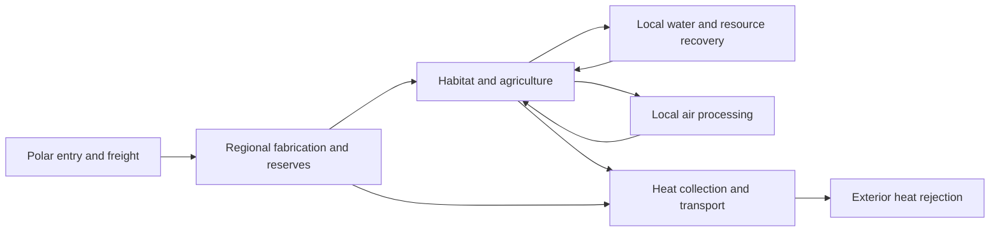

# Inner shell design — engineering-informed layout study

11 September 2026 · Proposed Observatory work, queued for a later pass

Keep the freely oriented habitat waist, the three Shade tracks above it, the supporting machinery to either side, and two opposing polar entry facilities. Make the surface more convincing by giving its visible patterns a common cause: terrain, water, light, transport, maintenance and damage.

This study draws on NASA habitat, life-support, plant-growth and thermal-control research, plus USGS drainage-network work. The layouts below are original proposals for the Observatory. NASA has not validated an AU-scale inhabited solid shell. Gravity, support, atmospheric containment and maintained Shade motion remain the project's explicit assumptions. This study does not amend the separate world canon or Unreal contract.

## What the research changes

### 1. The waist is an engineered geography

NASA's solar-irradiance reference gives approximately 1,361 W/m² at Earth's orbital distance, versus approximately 340 W/m² averaged over Earth's globe. In our geometry, an unobstructed surface normal points toward the central star everywhere. There is no Earth-like latitude reduction in direct flux and no ordinary sunrise caused by rotating the shell around that star. [NASA Goddard: Solar Irradiance Science](https://earth.gsfc.nasa.gov/climate/projects/solar-irradiance/science)

**Our inference:** a cold district needs a reason such as a lower time-averaged light dose and active cooling. A wet district needs water and a circulation regime. Merely placing ice toward a drawn pole supplies neither. Preserve the waist as the builders' chosen service and illumination axis; use the Shade schedule, water infrastructure, local terrain and environmental controls to organize its biomes. Shade passes alone should not be described as a solved climate model.

A uniform shell contributes no net gravitational field inside its cavity. Local water drainage and atmosphere profiles here assume the already adopted artificial downward acceleration. Rotation alone would not provide that same normal acceleration at all latitudes. [Jo Bovy: Newton's shell theorems](https://galaxiesbook.org/chapters/I-01.-Gravitation_2-Spherical-systems%3A-Newton%27s-shell-theorems.html)

### 2. Life support should appear as connected systems

NASA's ECLSS architecture distinguishes water recovery, air revitalization and oxygen generation. It links water purification and storage to oxygen production and carbon-dioxide processing. The useful design lesson is that a habitat contains flows, treatment stages, reserves and service access, rather than an undifferentiated machinery carpet. [NASA: Environmental Control and Life Support Systems](https://www.nasa.gov/reference/environmental-control-and-life-support-systems-eclss/)

**Our design translation:** place reservoir and treatment districts next to the areas they serve. Show repeated modules within each facility, connecting routes between facilities, and several independent service centres within a province. Put fabrication yards at freight interchanges. Keep clean-water distribution visually distinct from waste processing. Treat reservoirs and planted wetlands as supporting systems, not as an automatic guarantee of potable water or complete ecological closure.

NASA greenhouse studies link plants with food, air and water recycling. Its plant research also explicitly controls light, humidity, temperature, water and nutrients. These support a distinction between wilderness, food production and environmental machinery. A forest should not stand in for every life-support function. [NASA: Lunar and Martian greenhouse research](https://www.nasa.gov/science-research/lunar-martian-greenhouses-designed-to-mimic-those-on-earth/), [NASA: Plant Biology Program](https://science.nasa.gov/biological-physical/focus-areas/plant-biology/focus-areas/)

### 3. Heat needs a destination outside the cavity

NASA thermal-control guidance treats the radiating area, emissivity, temperature and view of the heat sink as decisive. Its lunar habitat study separates internal coolant circuits from external heat rejection. [NASA: Thermal Control](https://www.nasa.gov/smallsat-institute/sst-soa/thermal-control/), [NASA NTRS: Lunar Surface Habitat thermal architecture](https://ntrs.nasa.gov/citations/20220003526)

**Our design translation:** the existing inner thermal fields become collection, pumping, conversion and routing districts. Rejection takes place on the exterior or in an explicitly separate system with a view to space. Interior fins can exchange heat with the cavity; they cannot dispose of its total energy. Shades redistribute where stellar energy is absorbed unless that energy subsequently leaves the Sphere.

For a scale check, assume a closed shell intercepts a solar star's luminosity at one AU, its effective outward radiating area equals its shell area, emissivity is 0.9, and the exterior sink is cold. The illustrative balance is:

`outward flux = emissivity × Stefan–Boltzmann constant × temperature⁴`

At 300 K, that surface emits about 413 W/m². Removing 1,361 W/m² therefore requires about **3.29 times** as much effective radiating area, or a higher radiator temperature: about **404 K** for equal areas under these assumptions. These are our calculations, not a NASA estimate for the Sphere. They omit detailed transport, extra power sources, view-factor losses and any energy escaping through openings. A cool habitat coupled to hotter radiators also needs a thermodynamically valid heat-pumping system and its power budget; drawing hot panels does not solve that problem.

The visual consequence is useful even before a thermal simulation exists: distinguish inhabited ground, cooler service loops, hotter industrial systems and outward heat-transfer interfaces. Do not paint everything bright copper and label it a radiator.

### 4. Natural textures need terrain and drainage underneath them

USGS treats watersheds and drainage networks as spatial structures for representing water movement over terrain. NASA observations show how geology and floodplains shape branching rivers and their surroundings. [USGS: Watersheds and drainage networks](https://www.usgs.gov/publications/watersheds-and-drainage-networks), [NASA Earth Observatory: Fizzy Tropical Rivers](https://earthobservatory.nasa.gov/images/92450/fizzy-tropical-rivers)

**Our design translation:** give each local basin a source, downhill channels, a receiving lake or sea, and an engineered return path where needed. Put marshes near receiving waters, greener corridors along drainage and drier terrain beyond them. Build agriculture around access and irrigation. Let natural boundaries meander while maintenance parcels have purposeful edges. These are local engineered watersheds under assumed gravity, not a claim that one river can service an astronomical belt.

## Three layout candidates

Each candidate preserves the current waist and the two poles. The names below describe proposed patterns, not additional biomes or committed canon.

| Candidate | What would be visible | Organizing reason | Main tradeoff |
|---|---|---|---|
| **A. Watershed network — recommended** | Large irregular biome provinces, branching waters, occasional agricultural mosaics and settlements; paired service corridors bordering the waist; cross-links to repeated machinery districts | Local catchments organize ecology; distributed service centres support each province; freight connects districts | Natural-looking boundaries need a coherent terrain and water model, even if initially authored |
| **B. Compartmented habitat** | Broad habitat basins divided by clear berms and service ridges; forests and water within them; repeated containment and maintenance nodes | Independent environmental cells provide local control and fault isolation | More visibly engineered. Berms alone do not contain different gases or stop depressurization; those functions need explicit barriers or the existing fictional containment mechanism |
| **C. Industrial backbone** | Broad longitudinal service corridors through the waist, clustered fabrication and storage regions, natural provinces between them; strong feeder routes toward the ports | Freight, maintenance and energy distribution dominate the construction pattern | Most legible from afar, but excessive regularity could reproduce today's checkerboard look and overwhelm the biomes |

**Recommendation:** use A for the large-scale composition, selected B-style service boundaries where environmental differences require them, and C-style industrial organization within actual machinery districts. Avoid laying the same regular grid over all three systems.

NASA's 1977 *Space Settlements: A Design Study* is a useful historical precedent for considering a settlement as an integrated system. Its stated scope was a conceptual study of sustained life in space, not a validation of the Sphere's dimensions or mechanisms. We are not transplanting its settlement proportions. [NASA NTRS: SP-413](https://ntrs.nasa.gov/search.jsp?R=19770014162&hterms=NASA+SP-413+Space+Settlements)

## Recommended arrangement in the Observatory

**The habitat waist.** Keep the current ±20° envelope and three illumination ribbons. Inside it, replace rectangular biome assignments with a hierarchy of irregular provinces and smaller catchments. Large-scale light schedules and authored environmental targets constrain the province choices; local moisture and terrain produce variation within them. Leave extensive uninterrupted wilderness. Agriculture, settlements and service land should be recognizable clusters rather than a uniform density everywhere.

**The two shoulders.** Place broad service transition regions immediately outside the waist: water recovery and storage, air processing, crop-support industry and thermal collection. Their appearance should derive from their connected facilities. Channels broaden into basins; repeated treatment cells attach to trunks; access routes reach individual modules. The boundary with habitat land should include reservoir shores, protected clearances and service entrances.

**The machinery fields.** Keep three principal families: thermal routing; air, water and resource recovery; fabrication and repair. Assign each district a dominant role, then subordinate supporting functions. Some areas are dense process equipment, some regular storage modules, some mostly exposed shell with service routes and access space. Districts need different orientation, spacing and weathering, rather than unrelated noise on the same universal grid.

**The poles.** Keep exactly two major entry complexes perpendicular to the waist. Give each a layered approach: clearance zone, arrival structure, distribution yards, workshops and service connections. At current scale, the coloured polar region is a vast service catchment, not one enormous airlock. Only the actual entrance and selected nearby facilities acquire human-readable geometry. The ports can be ceremonial and strategic gateways without requiring every litre of water or every repair part to pass through them.

**The service network.** Connect the layout at several scales. Small local loops do routine circulation. Regional interchanges distribute material and spare capacity. The visually continuous belt routes indicate many linked sections, not one unbroken pipe running around an AU-sized shell. Avoid a single infrastructure failure disabling an entire hemisphere by design.

This is a functional diagram. It is not a proposed universal plumbing circuit or a mass-balanced life-support simulation.

## The scale rule that will most improve the texture

At the default radius, **one degree covers about 2.61 million km**, and the full 40° waist spans about **104.44 million km** from one side to the other. The waist occupies about **34.2%** of the inner area. Those values are calculated from the app's radius and angular envelope.

A line legible across a substantial part of an overview cannot represent an ordinary roadway. Broad visible patterns should represent collections of districts, environmental regimes or huge structural divisions. As the camera approaches, they resolve into provinces, local catchments, facilities and finally equipment. We should never enlarge an individual pump, tree or road just to keep it visible in an overview.

| Viewing scale | Appropriate visible information |
|---|---|
| Whole interior | Habitat/service proportions, broad albedo and moisture structure, strategic routes, polar service regions, major damage |
| Province approach | Coastlines and basins, dominant infrastructure clusters, terrain, drainage, large wreckage footprints |
| Local flight | Actual facility parcels, roads, treatment cells, vegetation groups, wreck panels and structural shadows |
| Walking | Metre-scale terrain and materials, individual trees and pipes, collision, entrances and selected interiors |

These layers must share world addresses and seed data. Filtering should replace unresolved detail with its correct aggregate colour and coverage, not allow it to sparkle as a checkerboard. Image resolution alone cannot solve this scale mismatch.

## Transitions and the post-attack world

Preserve the **original surface identity** separately from its present condition. A location should carry its terrain/biome, infrastructure role, damage, moisture and wreckage membership. The post-attack view then describes what happened to that same place.

Use soft ecological transitions for compatible climates: canopy thins into grass, wet ground follows drainage, coastal sediment changes toward water. Use actual shorelines, berms, access strips, retaining structures or containment systems where the boundary is physical. Incompatible atmospheric compositions cannot stay adjacent indefinitely in freely mixing air merely because their textures differ.

Ruin should retain traces of the district that failed: flooded circulation plants, collapsed fabrication halls, exposed thermal galleries, ruined farmland or forest rooted through wreckage. The user identified baked-in green patches as the mismatch beside other biomes, then explicitly requested **unique edge textures for every biome** and progressively increasing damage toward the edge. Ten such images are now implemented. They preserve fractured construction with local growth, snow, sand, staining and debris; distinctive Ruin regions away from Wounds retain their existing artwork.

**Wound navigation, as requested:** a selected shell intersection well inside an opening leads to the breach inspection environment. A selected point inside the opening but close enough to its rim leads to an edge view informed by the nearest adjoining biome. A selected point on surviving ground remains there, with edge context where visible. The choice should use the selected location and the nearest actual boundary, not always snap to the default Wound expedition. The transition threshold needs calibration against wall readability and scene scale; it should be stable under small cursor or camera changes.

**Wound materials:** the surviving surface transitions over a fixed 240 km damage zone into its biome's dedicated shattered-shell albedo. The upper 40 m of the wall inherit this deposit; deeper cross-sections retain substrate, service layers and structure. Snow, soil, roots, corroded machinery and shoreline sediment should not turn kilometre-deep structural layers into solid forest or all snow. Ten unique images are shared across the six Wounds by adjoining biome, with matching measured mean colours for distant views. These distances are authored visual scales, not a simulated fracture or impact result. [Artwork and implementation details](../assets/wound-edges/README.md)

**Fallen Shades:** give major missing fragments parent Shade IDs and planned outcomes: surface impacts, surviving cavity debris or escape through a Wound. The impact location follows an authored, stated attack trajectory until a dynamical model exists. It is not automatically below the original Shade. Preserve the former biome beneath the impact scar; render broken skin and structural members consistently from the overview to a future local site. Large impacts must leave commensurate disturbance rather than a pristine forest with a plate laid on top. Exact mass and impact energy remain unknown until thickness, density, fragment fractions and velocities are defined.

## Practical next deliverable

Produce one comparative shell atlas before changing the live geography: the current layout alongside these three alternatives, with separate views for biome, service function, water, transport and damage. Use the same radius, waist and polar axis. Include a forest, an industrial district, a biome boundary, and two differently sourced Wound edges at matched approach cameras.

Then implement the chosen atlas as a versioned layout with CPU/GPU agreement, stable addresses and old-scene compatibility. Far colour, local material selection, walking terrain, Wound context and Shade lighting must all read the same world description. Keep climate proxies labelled as proxies. A live fluid, climate or whole-surface population simulation is not required to make the next visual pass substantially more coherent.

The associated priorities and resumption notes are in [the Observatory queue](Observatory-Queue.md).
