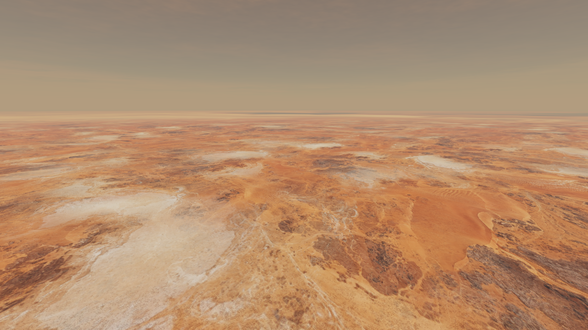

# Hero landscape comparison

Matched screenshots at 1 km, captured from the Observatory renderer. The gallery includes all ten biomes before and after the three optimization passes, plus final grazing views.

After starting Observatory, open `/examples/hero-review/index.html` in your browser for the complete comparison. The HTML and PNGs also work locally without the rendering app.

[Independent scores and limitations](../../docs/texture-critic-review.md) · [Implementation notes](../../docs/Observatory-Hero-Textures-10.md)

Only this curated set ships in Git. The larger developer capture archive remains under the ignored `tests/artifacts/hero/` directory and can be regenerated with the documented test harness.
