# Photographs from Observatory v1.5

Seventeen fresh **3840 × 2160** photographs from the running v1.5.0 source build. The smaller JPEGs on this page are display copies; every linked PNG is unretouched output from the Observatory renderer.

To return to a photograph, download its scene JSON and choose **Capture → Import scene**. Each scene contains the camera, world, time, seed and actual rendering settings. Hardware, browser and later renderer changes may affect exact reproduction.

### The Sphere from the polar court

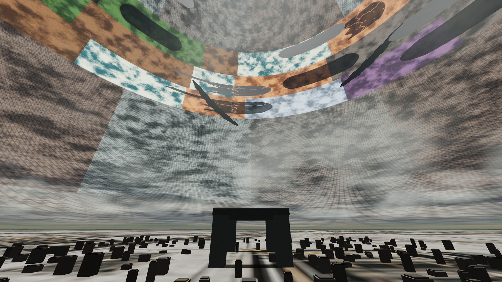

The polar court beneath the habitat bands, Shades and Wounds. The camera, lens and world staging come from the saved reference photograph; this is a fresh v1.5 render with current Shade bodies. The polar court retains its authored landmark geometry.

[Original 4K PNG](hero.png) · [Restore scene](hero.json)

### Ultra Desert

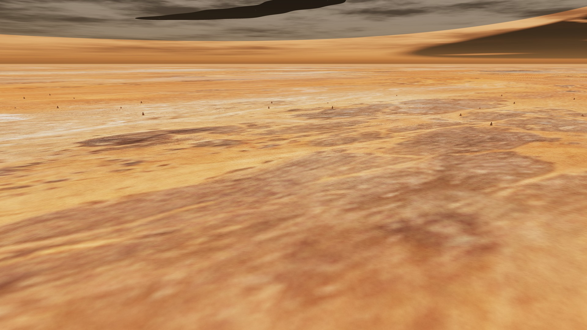

A low aerial view of Ultra Desert, with its warm surface material, sparse local formations and the opposite shell overhead. This is a procedural field site, not fully authored desert terrain.

[Original 4K PNG](ultra-desert.png) · [Restore scene](ultra-desert.json)

### Winter Hell

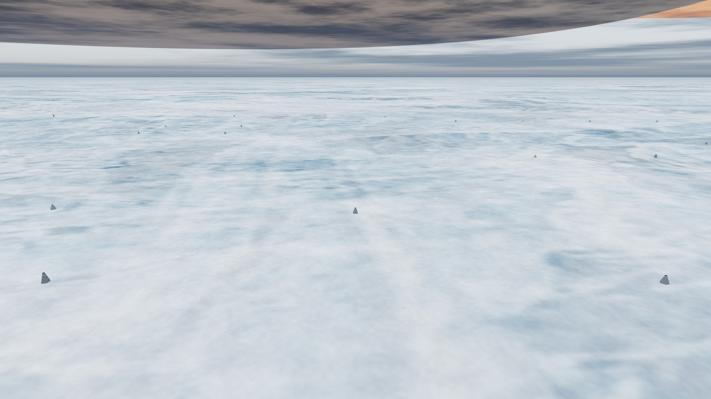

A low aerial view of Winter Hell. Pale ice materials continue between local walking geometry and the surrounding shell. The two biome views use the same lens and relative camera staging.

[Original 4K PNG](winter-hell.png) · [Restore scene](winter-hell.json)

## Watersheds at six scales

These are the six named Watershed arrival presets, from the surrounding neighbourhood to the garden terrace. Regional heights are above the shell; the garden height is relative to its landscape and the terrace height to its floor.

### Connected catchments · 40,000 km

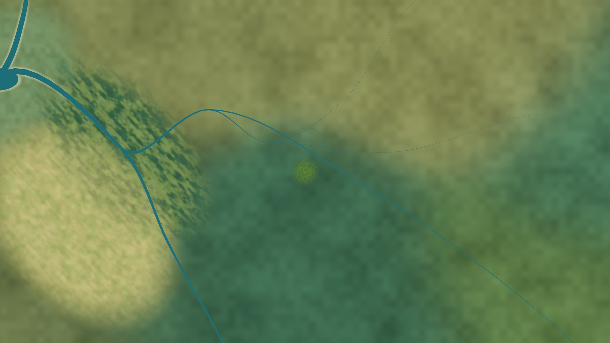

Connected catchments at the 40,000 km arrival: the neighbourhood surrounds the original province with regional drainage and receiving country.

[Original 4K PNG](watershed-40000.png) · [Restore scene](watershed-40000.json)

### Receiving reaches · 10,000 km

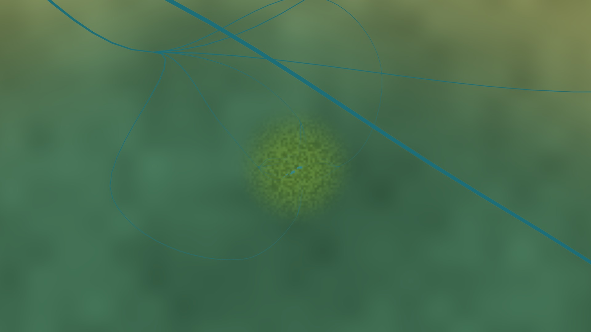

The 10,000 km arrival connects the central province to the surrounding receiving reaches. The landscape uses the current saved Watershed pack.

[Original 4K PNG](watershed-10000.png) · [Restore scene](watershed-10000.json)

### The province · 1,100 km

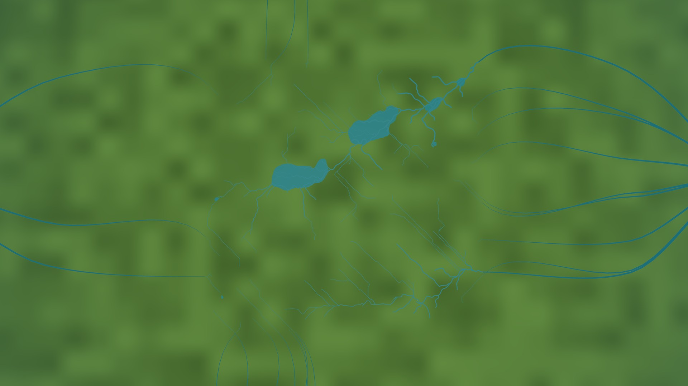

The 1,100 km arrival looks across the original 640 km river-garden province and its basins.

[Original 4K PNG](watershed-1100.png) · [Restore scene](watershed-1100.json)

### River country · 48 km

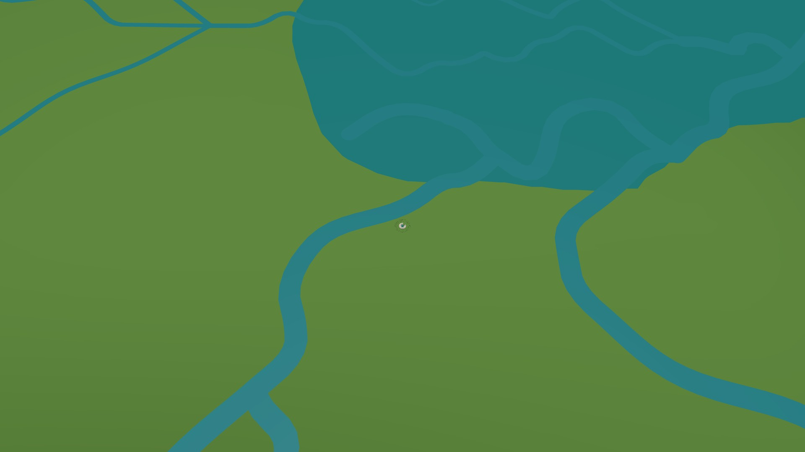

The 48 km approach brings the river, banks and receiving water into a single view. Regional water is a static rendered surface.

[Original 4K PNG](watershed-48.png) · [Restore scene](watershed-48.json)

### The water garden · 1 km

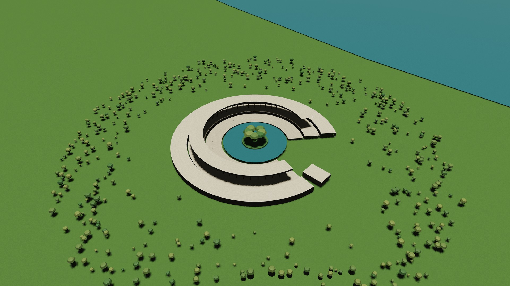

One kilometre above the garden landscape: curved terraces, an island court and local planting beside the river.

[Original 4K PNG](watershed-1.png) · [Restore scene](watershed-1.json)

### The open terrace · 6 m above its floor

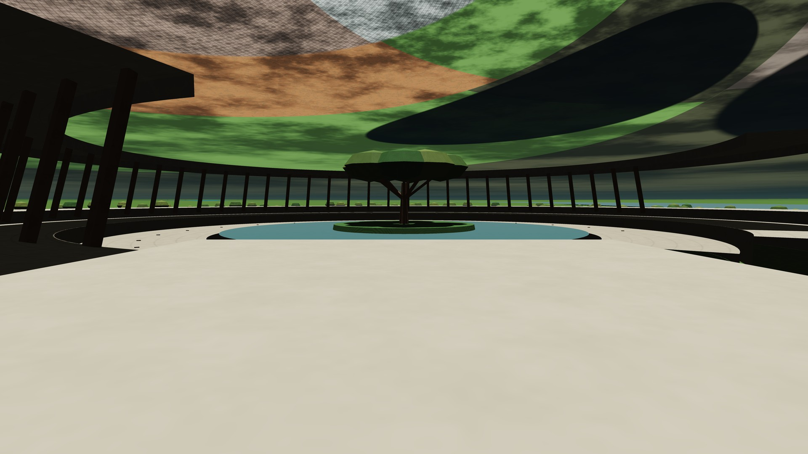

Six metres above the terrace floor. The same garden can be inspected from human scale beneath the distant inner shell.

[Original 4K PNG](terrace.png) · [Restore scene](terrace.json)

## Three Watershed compositions

Choose these through **Explore → Places → Watersheds → Landscape view**.

### The receiving lake

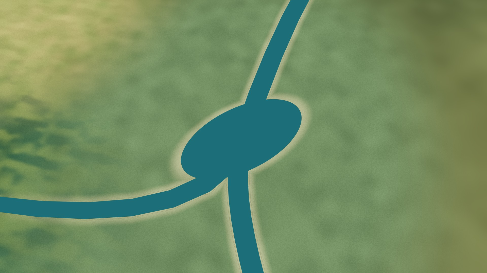

The receiving lake, viewed from its 9,000 km regional composition camera. Geography revision 1 and art revision 2 are saved in the scene.

[Original 4K PNG](lake.png) · [Restore scene](lake.json)

### The quiet reach

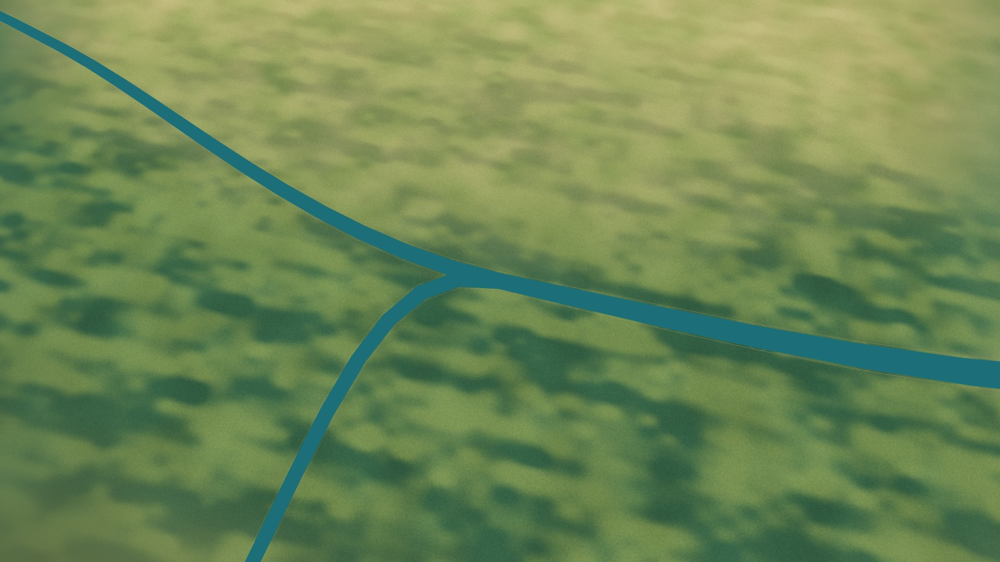

The quiet reach, viewed from its 9,000 km regional composition camera. The river and banks belong to the connected neighbourhood.

[Original 4K PNG](reach.png) · [Restore scene](reach.json)

### The open meadow

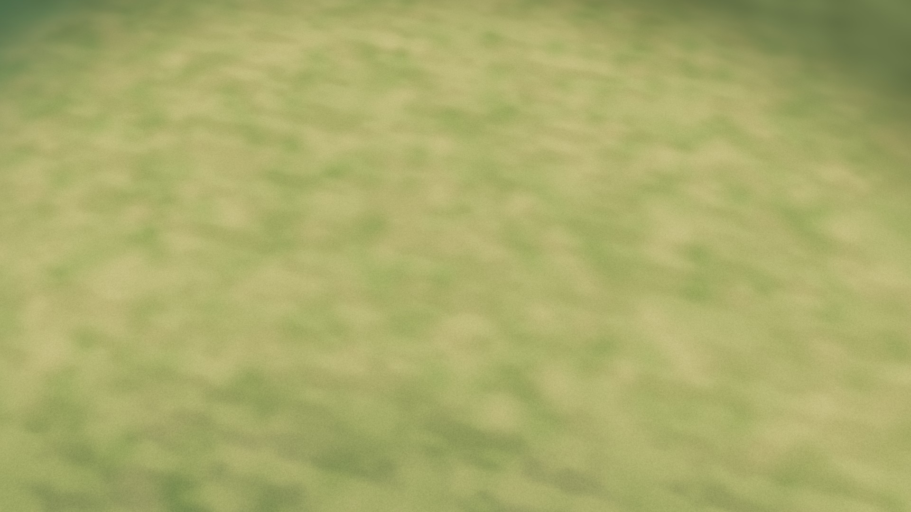

The open meadow, viewed from its 9,000 km regional composition camera. Regional material variation is implemented; detailed local shore environments remain future work.

[Original 4K PNG](meadow.png) · [Restore scene](meadow.json)

### The finished Shade perimeter

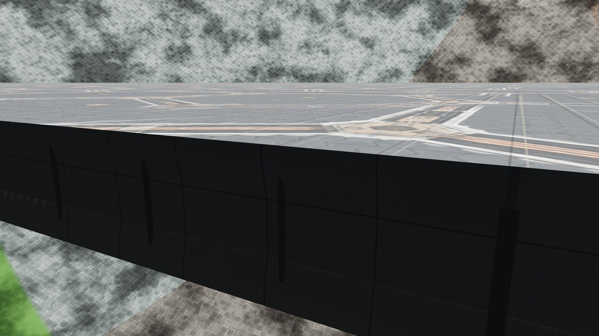

A finished perimeter on Shade 4. Both faces and the 180 m layered body are visible; vertical members close the intact edge. Geometry revision 3 discovers detail automatically.

[Original 4K PNG](shade-intact.png) · [Restore scene](shade-intact.json)

### The broken Shade edge

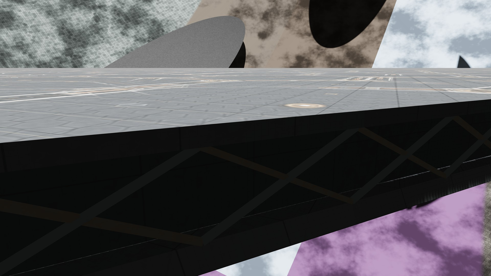

The exposed edge of Shade 0. Layered returns and braces follow a damaged boundary on the moving parent. The simulation is paused for this photograph.

[Original 4K PNG](shade-broken.png) · [Restore scene](shade-broken.json)

### At the edge of a world


An oblique view along an exposed Wound wall with surviving surface and clouds above it. Shell thickness and engineering details are provisional.

[Original 4K PNG](wound.png) · [Restore scene](wound.json)

### The stellar conservatory


The Sun-sized star and its damaged service rings, framed from within the vast cavity. Exposure is an artistic display choice, not calibrated photometry.

[Original 4K PNG](interior.png) · [Restore scene](interior.json)

### Above the Super Jungle


Nine kilometres above Super Jungle, with local cloud banks below and the distant shell overhead. Weather and atmosphere are approximate rendering models.

[Original 4K PNG](clouds.png) · [Restore scene](clouds.json)

## Capture and provenance

[Gallery metadata](gallery.json) records the source-content fingerprint, GPU, output dimensions, every PNG hash and all adjacent-frame comparisons. The capture helper prepares the saved scene, draws three to eight paused frames, and requires the final two to match byte for byte. This checks the photographs presented here; it does not close the separately documented intermittent cold-capture diagnostic. No external compositing, retouching or generated replacement image is used. Some material artwork used inside the app was created with AI assistance.

All 17 final pairs matched in this run. The hero, Ultra Desert and cloud views had an earlier nonmatching pair, retained in the metadata. Graphics errors and page errors were zero.

The hero reconstructs the supplied reference using its [archived camera scene](../archive/v1.4/polar-station.json) and current Shade geometry. The other photographs are composed with current Places, Watershed and inspection controls.

Start the local server and configure Playwright and your browser as described in the [project README](../../README.md). Recapture the saved scenes with:

```sh
node tools/capture-gallery.cjs
python tools/gallery-previews.py
```

The preview helper requires Pillow. Supply shot IDs to capture selected photographs, for example `node tools/capture-gallery.cjs hero shade-broken`. To reconstruct the initial compositions before capture, run `node tools/compose-gallery.cjs`; this replaces the current gallery scene files.

[Previous public photographs and documentation images](../archive/README.md) remain archived with their original image bytes. The [pre-v1.5 manifest](../archive/pre-v1.5/manifest.json) records the relocated files and hashes. Runtime texture assets remain in `assets/` because they are part of the app.
