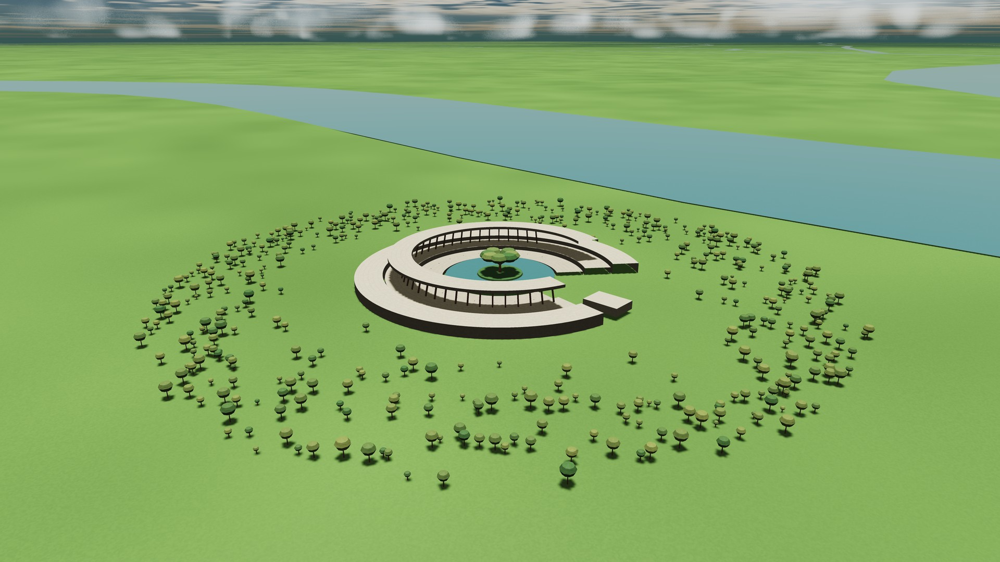

# Photographs from the Observatory

Seven newly composed **3840 × 2160** photographs from the running source build, connecting the star and immense shell to exposed structures, clouds and a river garden. All originals are direct renderer output. Exposure, lens and atmospheric settings were chosen in the app; no external retouching, compositing or generated replacement imagery was used. This page displays smaller JPEG copies for faster loading; each unchanged 4K PNG is linked below its image.

For each photograph, download its scene JSON and choose **Capture → Import scene** in the current app. The scene includes world state, camera, time, materials and actual rendering dimensions. These are prototype environments; the images do not imply completed global terrain or physical light transport. Some surface artwork within the app was created with AI assistance.

## The stellar conservatory


[Open original 4K photograph](interior.png).

A close stellar view makes the central star and broken service structure legible, with the far shell behind them. [Restore scene](interior.json).

## Across the interior


[Open original 4K photograph](cavity.png).

A wide view across the one-AU-radius shell. The star has become a small distant object; enormous Shades cross the habitat waist, and Wounds open through the surface. The large-scale atlas is still an interim representation. [Restore scene](cavity.json).

## At the edge of a world


[Open original 4K photograph](wound.png).

A wider, brighter view along a Wound's layered wall, with surviving ground on one side and the opening on the other. The shell thickness in this scene is an authored 12 km. [Restore scene](wound.json).

## The open river-garden terrace


[Open original 4K photograph](river-garden.png).

Six metres above the terrace floor in the first Watershed province: a human-scale architectural view inside a stellar-scale world. [Restore scene](river-garden.json).

## A garden beside the river



[Open original 4K photograph](watershed.png).

An oblique arrival connecting the terrace to its riverside landscape. The 640 km province is a bounded geography prototype with concentrated local detail. Water is a rendered surface, not a hydrodynamic simulation. [Restore scene](watershed.json).

## The broken Shade


[Open original 4K photograph](shade.png).

A close view retains material scale, the fractured edge and support structures beneath the deck. [Restore scene](shade.json).

## Above the cloud sea


[Open original 4K photograph](clouds.png).

Nine kilometres above the local shell, looking across volumetric cloud banks toward the distant interior. [Restore scene](clouds.json).

## Capture and provenance

[Gallery metadata](gallery.json) records image hashes, GPU identification, WebGL error status and every adjacent-frame comparison. Each image was captured after asset preparation at 4K, with the renderer's supersampling and edge filtering. Each scene JSON records the actual internal resolution. The helper takes three to eight paused frames and requires the final pair to match byte for byte. Earlier comparisons remain recorded, so a warmed capture does not conceal the known capture issue. Browser, GPU or future renderer changes may affect exact reproduction.

To recreate the gallery, start the local server and configure Playwright and your browser as described in the main README:

```sh
node tools/capture-gallery.cjs
```

Supply one or more IDs to recapture selected views, for example `node tools/capture-gallery.cjs river-garden shade`. Afterward, run `python tools/gallery-previews.py` with Pillow installed to refresh the smaller GitHub display copies. These tools write into the current gallery only. The [previous photographs](../archive/README.md) remain archived with their original image bytes and scene files.

The initial capture attempt stopped when the Wound's second and third 4K frames differed. A fresh run produced matching first, second and third frames for all seven scenes, as recorded in the metadata. This successful retry does **not** close the existing intermittent capture issue; no renderer fix is claimed by this documentation update.
