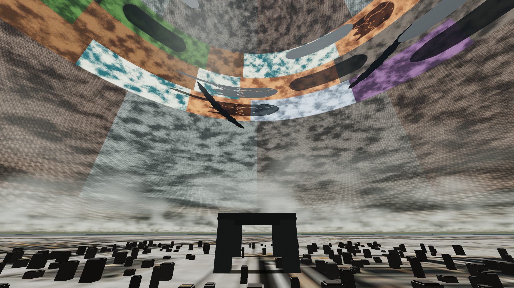
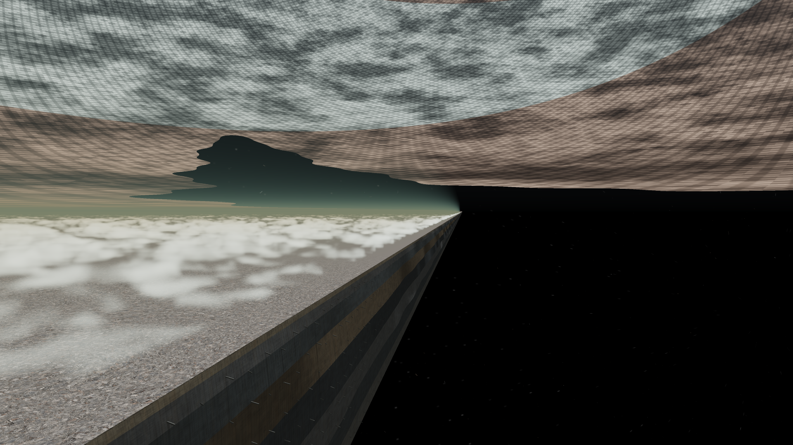
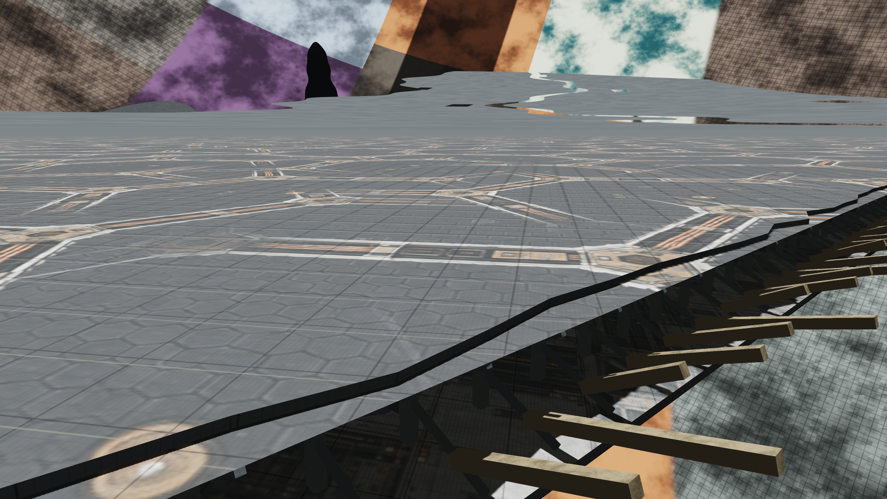
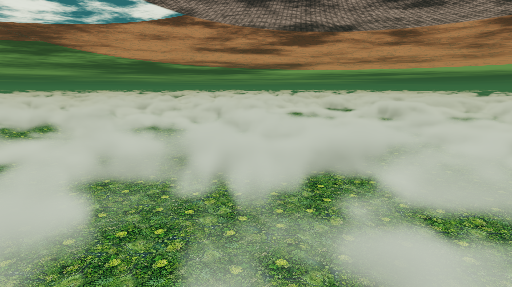
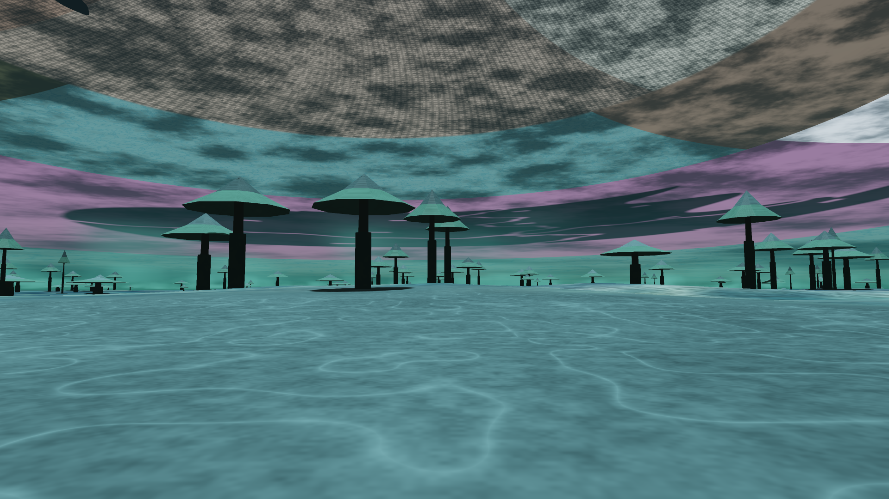
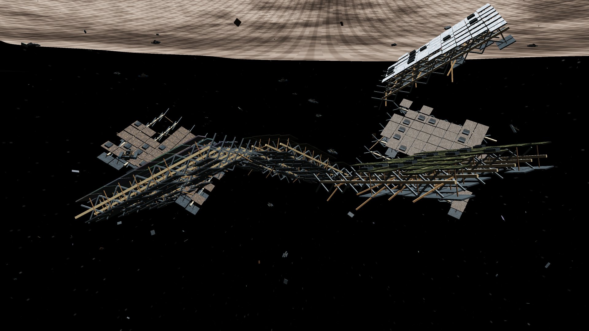

# Observatory v1.4 gallery

Six original, unretouched captures from the released renderer. The PNGs are 1920 × 1080, rendered internally at 3840 × 2160 with the app's supersampling and edge filtering. Exposure, lens and atmosphere were chosen in the Observatory; no external compositing, sharpening or image generation was used for these screenshots.

Download a companion scene JSON and use **Capture → Import scene** to explore its viewpoint. Reproducing the image requires v1.4 and its texture assets; browser and GPU differences can affect exact pixels. The walking and entry environments are prototype field sites.

## From the polar station



The entry court supplies a nearby sense of scale beneath the distant habitat bands and Shades. A 112° horizontal lens opens the view across the station and into the cavity. [Scene](polar-station.json).

## At the edge of a world



Cloud banks over surviving ground meet the layered shell wall and open space. [Scene](wound-edge.json).

## The broken Shade



A close inspection of the shared Shade material and streamed structural detail. The inspection camera follows the Shade when simulation time advances. [Scene](shade-structure.json).

## Above the cloud sea



Seven kilometres above the Super Jungle, with local volume rendering and the far inner shell overhead. [Scene](cloudscape.json).

## Walking the Mycelium Sea



One of the ten bounded, procedural walking samples. [Scene](mycelium.json).

## The ancient graveyard



Exterior fragments have geometry, depth and parallax. This is a composed wreckage field, not a dynamic debris simulation. [Scene](wreckage.json).

## Recreate the gallery

With the app served locally and Playwright configured as described in the main README:

```sh
node tools/capture-release.cjs
```

Pass a shot ID to recreate only that view, for example `node tools/capture-release.cjs polar-station`. The script uses committed scene fixtures, writes the PNG and scene pairs here, and updates [gallery metadata](gallery.json).
